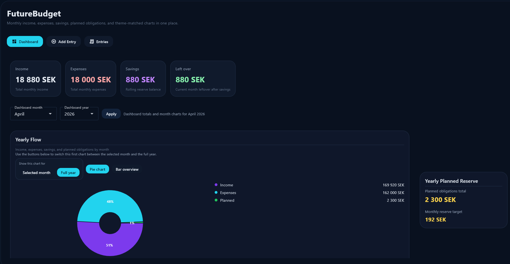
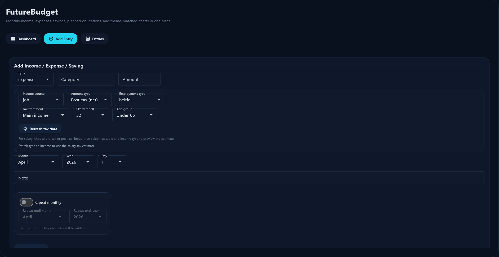
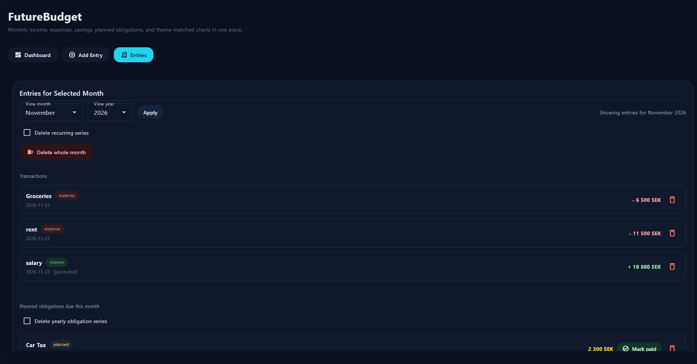

# FutureBudget

FutureBudget is a desktop budgeting app built with Flet for tracking income, expenses, savings, and long-term planned obligations in one place.

## What It Does

- Add `income`, `expense`, and `saving` entries by day and month
- Create recurring monthly transactions with series-aware deletion
- Track yearly planned obligations and mark them as paid
- Estimate Swedish salary tax using Skatteverket monthly tax tables
- Switch dashboard visualizations between monthly and yearly views
- See allocation-focused charts that reflect carry-over, spending, planning, and retained savings

## Screenshots

<p>
  
</p>

<p>
  
</p>

<p>
  
</p>

## Project Structure

- `main.py`: Flet UI, interaction logic, and view rendering
- `database.py`: SQLite schema, queries, recurring series logic, and flow calculations
- `charts.py`: Dashboard chart and allocation visualization helpers
- `calculations.py`: Swedish tax-table loading and salary estimation logic
- `data/`: Cached Skatteverket tax table file
- `Screenshots/`: README images

## Run Locally

1. Create and activate a Python 3.11 virtual environment.
2. Install dependencies:

```bash
pip install -r requirements.txt
```

3. Start the app:

```bash
python main.py
```

The app creates and uses a local SQLite database at `finance.db`.

## Dashboard Notes

- The main dashboard pie focuses on money allocation for the selected month or full year.
- The right-hand summary panel shows expected saved money by period end, total available money, and the retention percentage.
- The monthly allocation pie and category bars help compare actual spending versus what remains saved.

## Tax Support

FutureBudget includes Swedish salary estimation support using Skatteverket monthly tax tables. The app can work with:

- pre-tax gross salary input
- post-tax net salary input
- main income and side income handling
- selectable tax table and age group

The cached source file is stored in `data/skatteverket_allmanna_tabeller_manad_2026.txt`.

## GitHub Actions

The workflow in `.github/workflows/build.yml` does two things:

- compiles the Python source files on Windows and macOS
- builds desktop artifacts for Windows and macOS with PyInstaller and uploads them as workflow artifacts

## Packaging Output

GitHub Actions publishes these artifacts:

- `FutureBudget-windows`
- `FutureBudget-macos`

Each artifact contains a `FutureBudget` desktop bundle produced from `main.py`.
